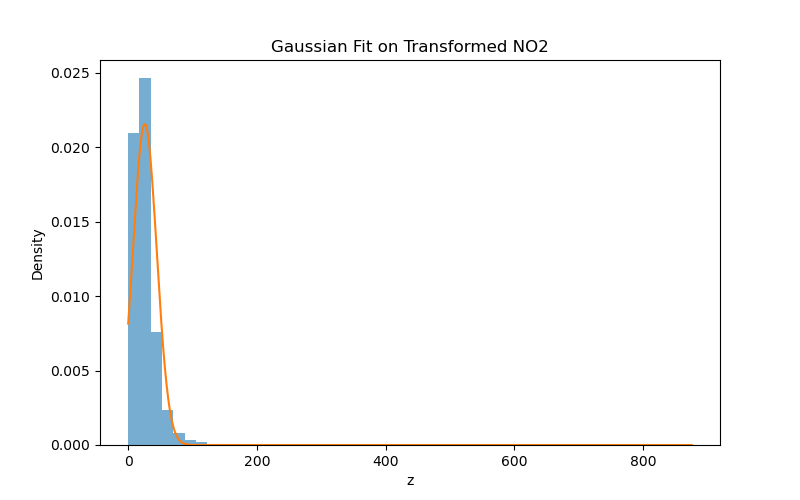

# Learning Probability Density Function using Roll-Number Parameterized Nonlinear Model

## Objective

The objective of this assignment is to learn the parameters of a probability density function after applying a nonlinear transformation to real-world NO₂ air quality data.

The transformation is parameterized using the university roll number.

---

## Dataset

Dataset used: India Air Quality Data (Kaggle)

Feature selected: NO₂ concentration

---

## Roll Number

102303077

---

## Step 1: Parameter Calculation

r mod 7 = 102303077 % 7 = 2  
r mod 5 = 102303077 % 5 = 2  

a_r = 0.05 × 2 = 0.1  
b_r = 0.3 × (2 + 1) = 0.9  

---

## Step 2: Nonlinear Transformation

Each NO₂ value (x) is transformed as:

z = x + 0.1 sin(0.9x)

This generates the transformed variable z.

---

## Step 3: Learning the Probability Density Function

We estimate parameters of the following density function:

p̂(z) = c · e^(−λ(z − μ)²)

Using maximum likelihood estimation:

μ = mean(z)  
σ² = variance(z)  

λ = 1 / (2σ²)  
c = 1 / √(2πσ²)

---

## Estimated Parameters

μ = 25.806857  
λ = 0.00145993  
c = 0.02155714  

---

## Visualization

The histogram of transformed data along with the fitted Gaussian curve:

---

## How to Run

Install dependencies:

pip install pandas numpy matplotlib

Run:

python main.py

---

## Conclusion

After applying the roll-number-based nonlinear transformation, the transformed NO₂ data was modeled using a Gaussian probability density function. The parameters μ, λ, and c were successfully estimated from the transformed dataset.

